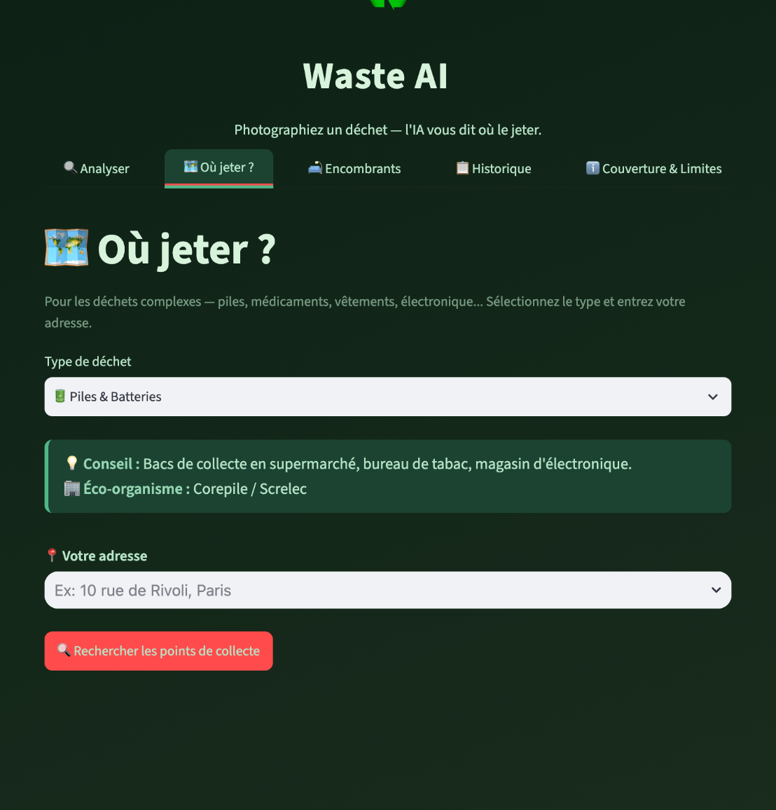
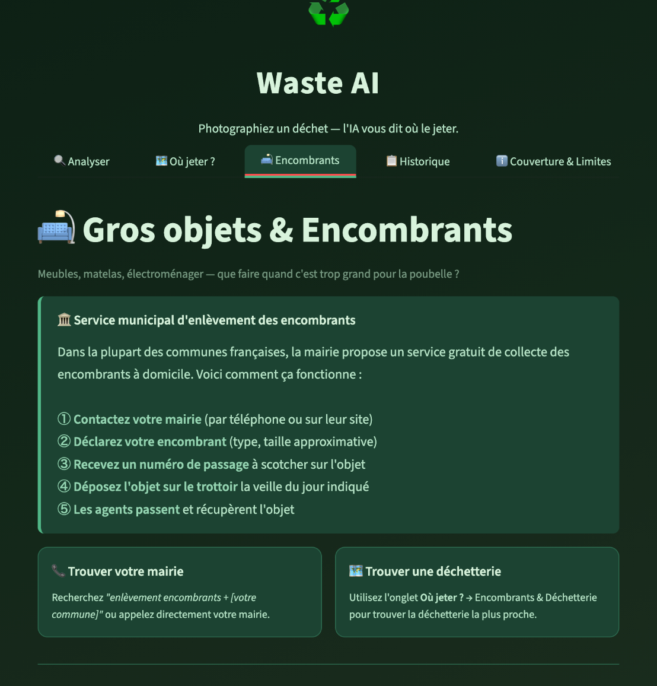
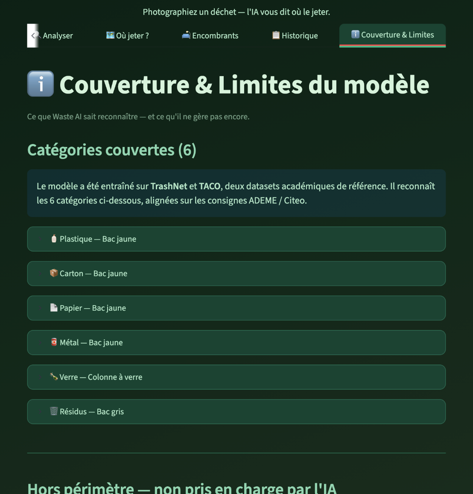
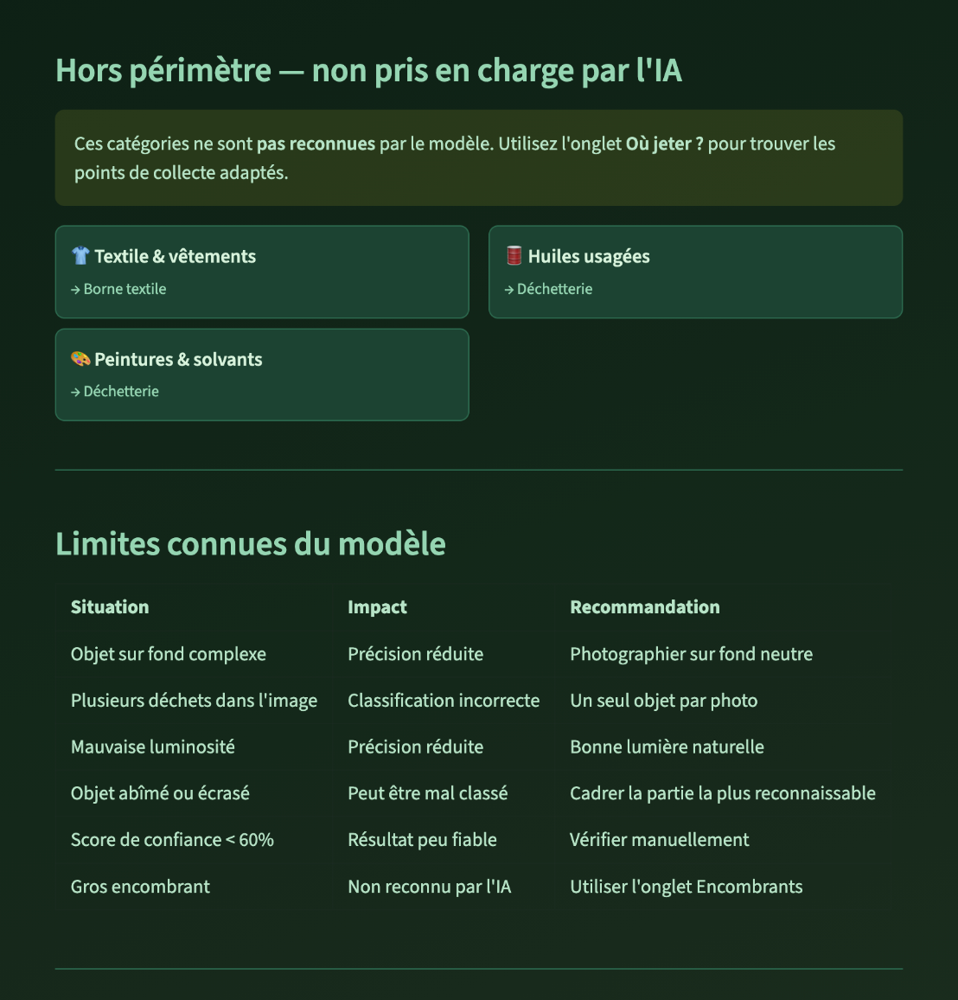

# Waste AI

A web application that identifies a piece of waste from a photo and tells the user which bin to use, following French sorting rules (ADEME and Citeo guidelines).

The image classifier is a fine-tuned EfficientNet-B2 that reaches 74.8% accuracy on 6 waste categories. The application is built with Streamlit and deployed on Hugging Face Spaces.

<!-- Add a screenshot of a classification result here, for example:
 -->



## Features

- Photo analysis from the camera or an uploaded image, with the predicted category, the matching bin and a confidence score
- "Where to dispose" map: for complex waste (batteries, medicine, clothes, electronics), finds the nearest collection points from an address using OpenStreetMap data (Overpass API)
- Bulky items guide: what to do with furniture, mattresses, appliances and rubble, and reuse alternatives
- User accounts and scan history, stored with Supabase
- Feedback on wrong predictions, to collect data for future training
- Coverage and limits page explaining what the model recognises and when its result should not be trusted

## Categories

- Plastic, paper, cardboard, metal: yellow bin (recycling)
- Glass: glass container
- Residual waste: grey bin

## Model

- Architecture: EfficientNet-B2 pretrained on ImageNet, fine-tuned with transfer learning (PyTorch, timm)
- Data: TrashNet (about 2,500 images, 6 classes) and TACO (real-world photos), with heavy data augmentation
- Training: Kaggle notebooks on GPU
- Result: 74.8% accuracy on 6 classes

The `notebooks/` folder keeps every training iteration, from a MobileNetV3 baseline to the final EfficientNet-B2 model, and an experiment with 8 classes (bulbs and electronics added from Open Images).

## Tech stack

- Machine learning: PyTorch, torchvision, timm
- Application: Streamlit, Folium (maps)
- Backend: FastAPI (prediction API)
- Data and services: Supabase (accounts and history), OpenStreetMap Overpass API and Nominatim (collection points and addresses)
- Deployment: Hugging Face Spaces

## Project structure

```
waste-ai/
  notebooks/       training notebooks (baseline to final model)
  model/           trained weights (not versioned, see below)
  api/             FastAPI prediction API
  frontend/        first Streamlit interface
  deploy/          final Streamlit application deployed on Hugging Face Spaces
  deploy-gradio/   alternative mobile version
```

## Run locally

Requirements: Python 3.10 or later.

```bash
git clone https://github.com/LorenzoLeMoineau/waste-ai.git
cd waste-ai/deploy
pip install -r requirements.txt
streamlit run app.py
```

The trained weights (`waste_ai_v4.pt`) are not stored in the repository because of their size. Place the file in the `deploy/` folder before running the application. Accounts and scan history require the `SUPABASE_URL` and `SUPABASE_ANON_KEY` environment variables; the rest of the application works without them.

## My role

I trained the image classification model: data preparation from TrashNet and TACO, data augmentation, fine-tuning of EfficientNet-B2 on Kaggle and evaluation. The final model (v4) is the one used in the deployed application.

## Screenshots

The user interface is in French.

### Bulky items guide



### Model coverage



### Known limits of the model



## Context

Group project at EFREI Paris (2026). Team: Nicolas, Jeremy, Arthur, Thomas, Louis and Lorenzo.
